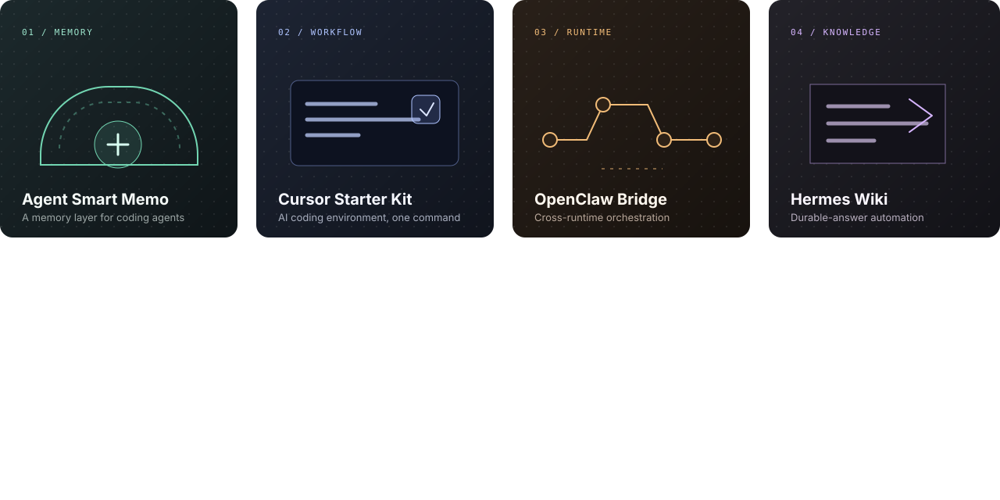

<p align="center">
  
</p>

<p align="center">
  <a href="https://github.com/cong91?tab=repositories"></a>
  
  <a href="mailto:thanhcong191@gmail.com"></a>
</p>

<br />

## Build the difficult parts.

I am **Cong Nguyen Thanh**, a Senior Full-Stack Engineer and Technical Advisor with 10+ years of hands-on experience turning complex product ideas into dependable systems. I work from architecture through implementation, delivery, and production support.

> **Based in:** Ho Chi Minh City, Vietnam  
> **Best fit:** Senior Full-Stack · Backend · Platform · Tech Lead  
> **Operating mode:** Architecture + hands-on delivery

Current work: **AI agent infrastructure**, project memory and retrieval, developer workflows, realtime systems, and technical platforms that span web, cloud, mobile, and hardware-adjacent software.

## Selected systems

<p align="center">
  
</p>

### [Agent Smart Memo](https://github.com/cong91/agent-smart-memo)
A project-aware memory platform for coding agents: runtime continuity, structured and semantic memory, repository indexing, and a shared retrieval control plane.  
`TypeScript` · `Retrieval` · `Agent memory` · `Developer tooling`

### [Cursor Starter Kit](https://github.com/cong91/cursor-starterkit)
A one-command AI coding workstation that configures skills, rules, MCP servers, hooks, project memory, task tracking, and verification workflows.  
`JavaScript` · `MCP` · `IDE workflows` · `Automation`

### [OpenClaw × OpenCode Bridge](https://github.com/cong91/openclaw-opencode-bridge)
A bridge for project-aware hybrid execution, callbacks, runtime lifecycle control, observability, and multi-project-safe agent workflows.  
`TypeScript` · `Runtime systems` · `Orchestration`

### [Hermes Wiki Automation](https://github.com/cong91/hermes-wiki-automation)
A tested pipeline that extracts durable answers from agent sessions and files them into an Obsidian-based engineering knowledge system.  
`Python` · `Knowledge systems` · `Automation`

<details>
  <summary><strong>More open-source work</strong></summary>
  <br />

- [Agent Knowledge Distiller](https://github.com/cong91/agent-knowledge-distiller) — curation pipeline for scoring, classifying, and preserving high-quality agent memory.
- [OpenClaw Jira Tools](https://github.com/cong91/openclaw-jira-tools) — tooling that connects agent workflows with work management.
- [Kotlin Android MVVM Boilerplate](https://github.com/cong91/Kotlin_Android_MVVM_BolierPlate) and [Kotlin Template](https://github.com/cong91/KotlinTemplate) — foundations for maintainable Android applications.

</details>

## Engineering surface area

<p align="center">
  
  
  
  
  
  
</p>

**Product systems**  
Full-stack applications, APIs, realtime interaction, service boundaries, reliability, and delivery.

**AI engineering**  
Agent workflows, RAG, function calling, context engineering, evaluation, and persistent project memory.

**Technical leadership**  
Architecture, code review, mentoring, integration problem-solving, deployment, and production readiness.

## Career path

```text
NOW        Technical Advisor · STEAM for Vietnam Robotics
2024–2026  Chief Technology Officer · LINKTO
2023–2025  Senior Game Developer · A5Labs / WPT Global
2015–2019  Mobile Technical Leader · Sun*
2011–NOW   Independent engineer across mobile, games, platforms, and AI developer tools
```

<p align="center">
  <strong>System thinking. Direct implementation. Software that holds up in production.</strong>
  <br /><br />
  <a href="https://github.com/cong91?tab=repositories">Explore all repositories</a>
  &nbsp;&nbsp;·&nbsp;&nbsp;
  <a href="mailto:thanhcong191@gmail.com">Get in touch</a>
</p>
