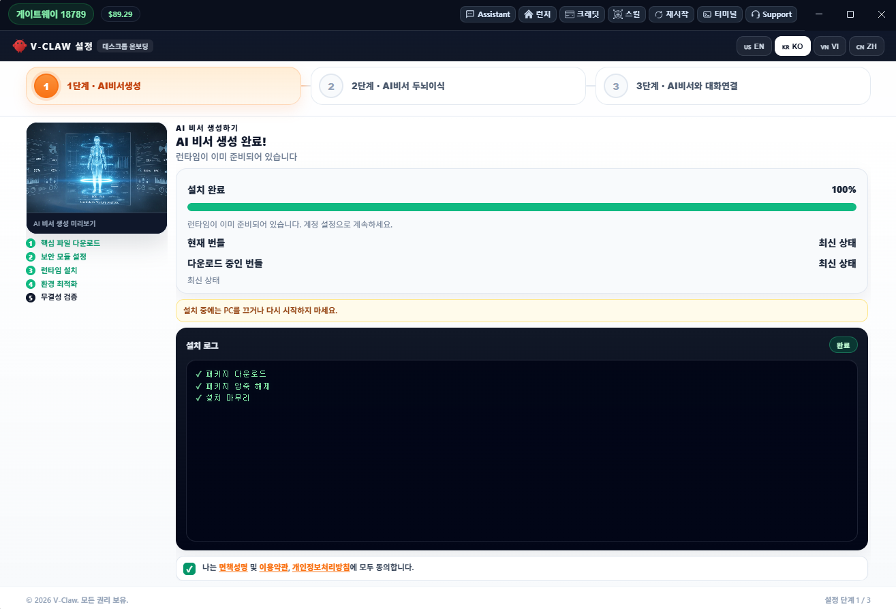

  

# Cong Nguyen Thanh

Senior Full-Stack Engineer and Technical Advisor in Ho Chi Minh City.

I have spent more than ten years building software across web platforms, backend services, mobile applications, cloud infrastructure, robotics, and cross-platform games. I am most useful when a product has difficult technical edges: unclear system boundaries, realtime integration, deployment constraints, or a team that needs architecture to become working software.

My current focus is practical AI infrastructure: tools that help agents remember context, execute real work, and remain understandable to the people operating them.

[Email](mailto:thanhcong191@gmail.com) · [All repositories](https://github.com/cong91?tab=repositories)

## Selected work

### Agent Memory

A project-aware memory system for coding agents.

I built Agent Memory because useful engineering context is usually scattered across conversations, source repositories, task trackers, and local notes. The system combines structured memory, semantic retrieval, project indexing, knowledge capture, and runtime integrations so an agent can continue work without reconstructing the project from scratch.

The public implementation is currently published as [`agent-smart-memo`](https://github.com/cong91/agent-smart-memo) and the npm package [`@mrc2204/agent-smart-memo`](https://www.npmjs.com/package/@mrc2204/agent-smart-memo).

**Built with:** TypeScript, SQLite, Qdrant, graph memory, semantic retrieval, OpenClaw, and OpenCode integrations.

### [V-Claw](https://v-claw.org/)

An approachable AI Agent platform for teams and users who should not need to become infrastructure specialists before they can automate useful work.

V-Claw packages the difficult parts of an OpenClaw-based setup into a Windows-first product with guided installation, portable and installed modes, model access, Skills, updates, and support. Its goal is execution rather than another chat interface: connecting agents to files, browsers, documents, business workflows, and custom automation.

  

[Product website](https://v-claw.org/) · [Bundle and checksums](https://github.com/cong91/v-claw-bundle) · [Desktop releases](https://github.com/cong91/v-claw-release/releases)

**Built with:** Electron, Node.js, OpenClaw, React, Vite, PowerShell packaging, and an extensible Skill system.

## Experience

- **Technical Advisor, STEAM for Vietnam Robotics** — architecture and delivery across browser-based robotics, simulation services, realtime communication, cloud, mobile, and automated evaluation.
- **Chief Technology Officer, LINKTO** — hands-on technical direction for an influencer-commerce platform built on microservices, event-driven data flows, analytics, AI features, and AWS infrastructure.
- **Senior Game Developer, A5Labs / WPT Global** — native Cocos Creator integrations across Android, iOS, Windows, and macOS.
- **Mobile Technical Leader, Sun\*** — architecture, mentoring, and production delivery for Android products in navigation, healthcare communication, employment, and location services.

## How I work

I stay close to implementation. Architecture should make the next decision easier, testing should reflect real failure modes, and production concerns should shape the design before release day.

I care about software that a team can understand, operate, and improve after the first version ships.
