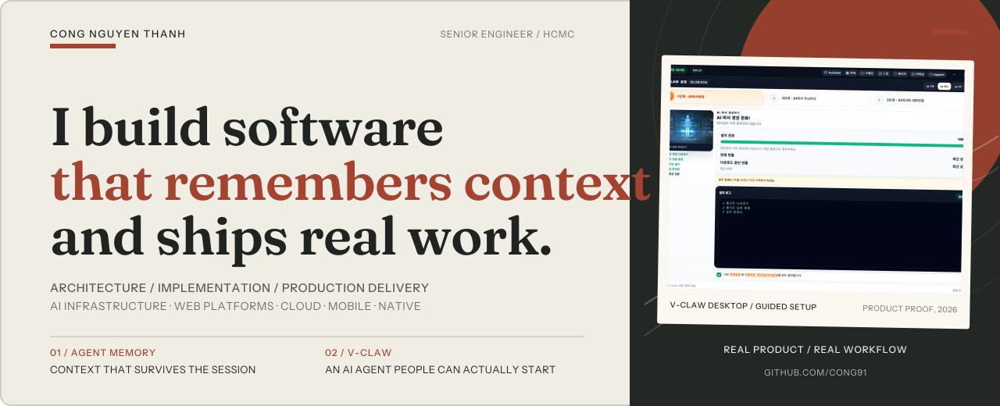

<!-- GitHub profile README -->

  

 

I design and ship software across **product, platform, and infrastructure boundaries**. My work spans full-stack web systems, distributed backends, mobile and native integrations, AI-assisted engineering, robotics simulation, and cross-platform games.

Currently focused on **coding-agent infrastructure**, **durable memory systems**, and **developer workflows** that make AI-assisted engineering more reliable.

<table>
  <tr>
    <td width="50%" valign="top">
      <strong>Product & Platform Engineering</strong>  
      Next.js, React, TypeScript, Node.js, NestJS, Python, PostgreSQL, Redis, Kafka, ClickHouse, REST, WebSockets
    </td>
    <td width="50%" valign="top">
      <strong>AI Engineering</strong>  
      Agent workflows, memory and retrieval systems, RAG, function calling, context engineering, evaluation, developer tooling
    </td>
  </tr>
  <tr>
    <td width="50%" valign="top">
      <strong>Cloud & Delivery</strong>  
      AWS, Docker, Terraform, GitHub Actions, CI/CD, Linux, Cloudflare, production operations
    </td>
    <td width="50%" valign="top">
      <strong>Mobile, Native & Interactive</strong>  
      Flutter, Kotlin, Android, BLE, USB serial, C++, Java, Objective-C, Unity, Cocos Creator, Webots
    </td>
  </tr>
</table>

## Selected work

### [Agent Smart Memo](https://github.com/cong91/agent-smart-memo)
A project-aware memory platform for coding agents, combining conversation continuity, structured and semantic memory, repository indexing, and a shared retrieval control plane.

### [Cursor Starter Kit](https://github.com/cong91/cursor-starterkit)
A one-command setup for a complete AI coding workstation: skills, commands, rules, MCP servers, hooks, project memory, task tracking, and verification workflows.

### [OpenClaw × OpenCode Bridge](https://github.com/cong91/openclaw-opencode-bridge)
A TypeScript bridge for project-aware hybrid execution, callback orchestration, runtime lifecycle management, and multi-project-safe agent workflows.

### [Hermes Wiki Automation](https://github.com/cong91/hermes-wiki-automation)
A tested Python automation pipeline that extracts durable answers from agent sessions and files them into a structured Obsidian-based knowledge system.

  
<strong>More engineering projects</strong>

   

- [Agent Knowledge Distiller](https://github.com/cong91/agent-knowledge-distiller) — scores, classifies, and curates agent memories into a higher-quality knowledge collection.
- [OpenClaw Jira Tools](https://github.com/cong91/openclaw-jira-tools) — TypeScript tooling for connecting agent workflows with Jira work management.
- [Kotlin Android MVVM Boilerplate](https://github.com/cong91/Kotlin_Android_MVVM_BolierPlate) — an Android starter project implementing the MVVM architecture.
- [Kotlin Template](https://github.com/cong91/KotlinTemplate) — a reusable foundation for Kotlin Android applications.

## Experience

| Period | Role and focus |
| --- | --- |
| **2025 — Present** | **Technical Advisor, STEAM for Vietnam Robotics** — architecture and delivery across browser-based robotics, simulation services, realtime communication, cloud, mobile, and automated evaluation. |
| **2024 — 2026** | **Chief Technology Officer, LINKTO** — hands-on technical direction for an influencer-commerce platform built on microservices, event-driven data flows, analytics, AI features, and AWS infrastructure. |
| **2023 — 2025** | **Senior Game Developer, A5Labs / WPT Global** — native Cocos Creator integrations across Android, iOS, Windows, and macOS, with emphasis on rendering, memory, compatibility, and CI/CD. |
| **2015 — 2019** | **Mobile Technical Leader, Sun\*** — architecture, delivery, mentoring, and production releases for Android products in navigation, healthcare communication, employment, and location services. |
| **2011 — Present** | **Independent engineering** — mobile, games, technical leadership, AI developer tools, and cross-platform product delivery. |

## Working principles

- Start from the system boundary and the user outcome, then choose the technology.
- Keep architecture close to implementation; important decisions should survive production constraints.
- Treat tests, observability, deployment, and maintainability as product work.
- Use AI to strengthen engineering judgment, not replace it.

   
  <a href="https://github.com/cong91?tab=repositories"><strong>Explore repositories</strong></a>
  &nbsp;&nbsp;·&nbsp;&nbsp;
  <a href="mailto:thanhcong191@gmail.com"><strong>Contact</strong></a>
    
  Based in Ho Chi Minh City, Vietnam · Open to senior full-stack, backend, platform, and technical leadership opportunities

